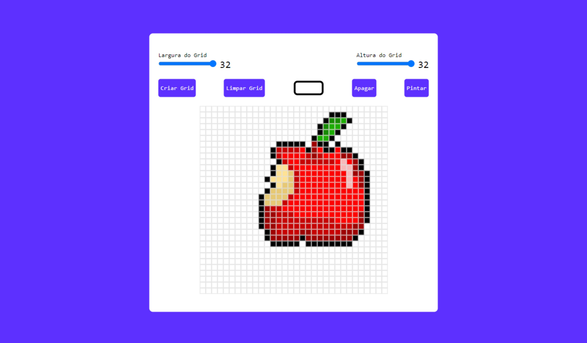

# Gerador de Pixel Art

## Sobre o projeto

Com esse app é possível criar imagens no estilo pixel art. É possível criar uma grid de tamanho personalizado de até no máximo 32x32. Também é possível salvar a imagem gerada em JPG, graças a biblioteca "domtoimage".

## Informações

Projeto desenvolvido utilizando apenas HTML, CSS e JavaScript.

